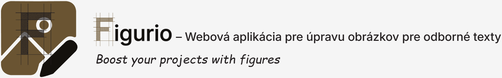
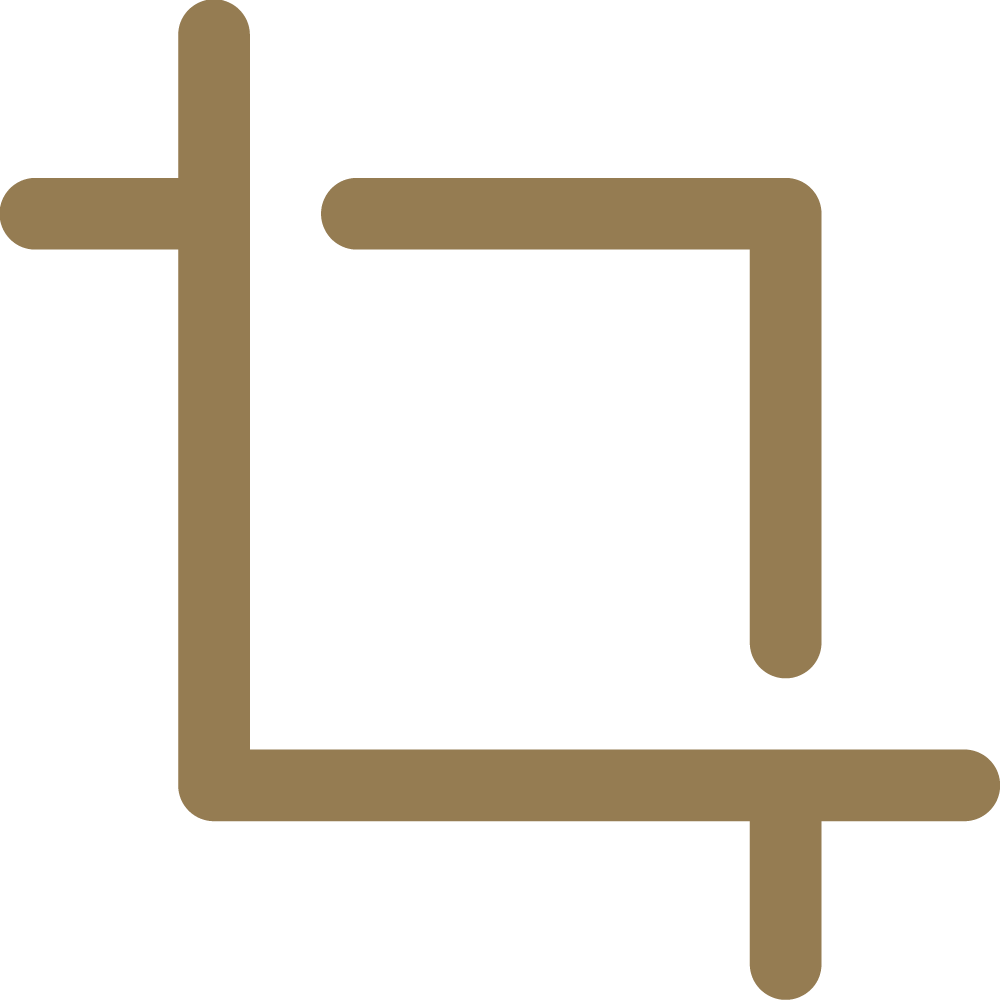
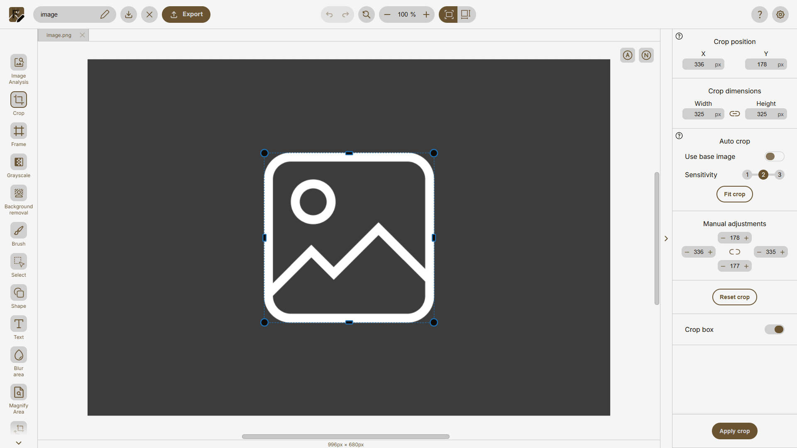
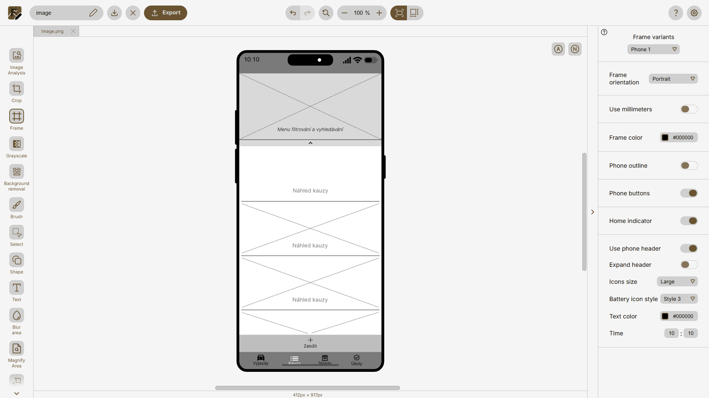
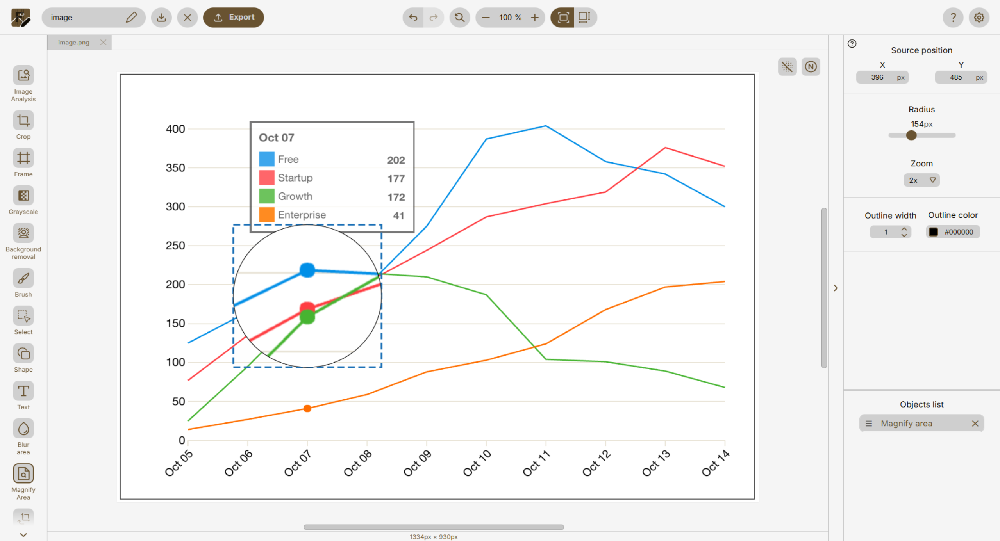
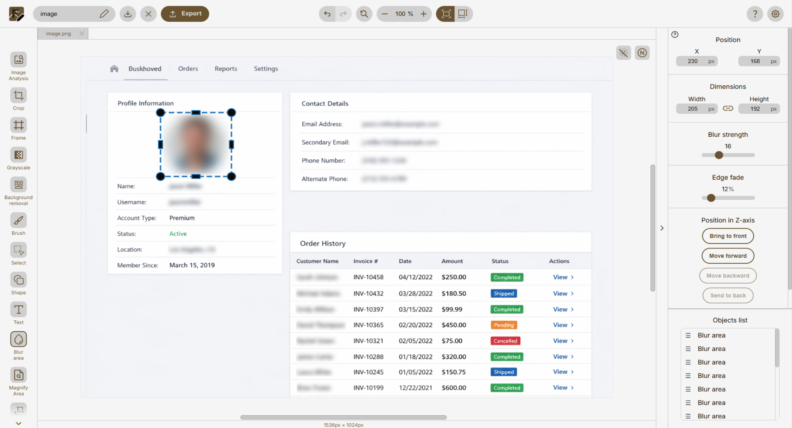

<p align="center">
  
</p>

# Figurio

**Figurio** je webový editor obrázkov určený na prípravu snímok obrazovky, diagramov a ilustrácií do akademických a technických dokumentov. Zameriava sa na rýchlu úpravu vizuálneho obsahu bez potreby používania komplexného grafického softvéru.

Aplikácia poskytuje nástroje na orezanie, zvýraznenie detailov, pridávanie anotácií a aplikovanie prezentačných rámov zariadení. Je navrhnutá s dôrazom na prehľadné používateľské rozhranie, konzistentný pracovný postup a efektívnu prípravu obrázkov vhodných pre LaTeX, technické správy a vedecké publikácie.

Figurio funguje priamo v prehliadači bez nutnosti inštalácie. Spracovanie obrázkov prebieha lokálne na strane klienta, čo zvyšuje ochranu súkromia a bezpečnosť spracovávaných dát.

**Verejne dostupná verzia aplikácie:** https://pavol-humeny.github.io/figurio/

---

# Autor

**Pavol Humeny**  
Fakulta informačných technológií  
Vysoké učení technické v Brně  

Projekt vznikol ako súčasť bakalárskej práce:

**Názov práce:** Webová aplikace pro úpravu obrázků  
**Akademický rok:** 2025/2026  
**Ústav:** Ústav počítačové grafiky a multimédií  
**Typ práce:** bakalářská práce  
**Zameranie:** Web  
**Jazyk práce:** slovenský  

**Vedúci práce:** prof. Ing. Adam Herout, Ph.D.

Cieľom práce je návrh a implementácia modernej webovej aplikácie pre manipuláciu s obrázkami so zameraním na prípravu vizuálneho obsahu do odborných textov (LaTeX, Overleaf). Súčasťou riešenia je analýza požiadaviek, návrh používateľského rozhrania, prototypovanie, iteratívne testovanie, integrácia funkčných celkov do výslednej aplikácie a príprava projektu na produkčné nasadenie.

Detail práce (elektronická verzia): https://www.vut.cz/studenti/zav-prace/detail/169466

---

# Kľúčové vlastnosti

Figurio sa od bežných online editorov líši najmä zameraním na odborné texty a technickú dokumentáciu:

- **Nástroje optimalizované pre akademické publikácie**  
  Rámiky zariadení, zvýraznenie detailov, rozmazanie oblasti, automatické orezanie okrajov.

- **Lokálne spracovanie dát**  
  Obrázky nie sú odosielané na server. Všetky úpravy prebiehajú priamo v prehliadači.

- **Vektorové spracovanie PDF**  
  PDF dokumenty sú spracovávané vektorovo bez zbytočnej rasterizácie (ak to charakter úpravy umožňuje).

- **Minimalistické rozhranie**  
  Jednoduché a intuitívne rozhranie bez nutnej znalosti pokročilých funkcií profesionálnych editorov.

---

# Prehľad funkcií

##  &nbsp; Crop (Orezanie)

Crop nástroj umožňuje:

- manuálne orezanie s presným nastavením oblasti
- zachovanie pomeru strán
- automatický *fit crop* na základe detekcie obsahu

Vhodné pre odstránenie prázdnych okrajov obrázka a jeho nežiadúcich častí.


<p align="center">
  
</p>

---

##  &nbsp; Frame (Prezentačné rámiky)


Umožňuje vložiť prezentačný rám:

- jednoduchý obrys
- rám okna aplikácie
- rám mobilného zariadenia

Zvyšuje vizuálnu kvalitu obrázkov v diplomových a technických prácach.

<p align="center">
  
</p>

---

##  &nbsp; Magnify Area (Zväčšenie oblasti)


Slúži na zvýraznenie detailu pomocou kruhového zväčšenia vybranej oblasti.  
Vhodné na prezentáciu drobných prvkov používateľského rozhrania alebo grafov.

<p align="center">
  
</p>

---

##  &nbsp; Blur Area (Rozmazanie oblasti)


Nástroj umožňuje selektívne rozmazanie vybranej časti obrázka. Používa sa na anonymizáciu citlivých údajov (napr. mená, e-mailové adresy, identifikátory) alebo na potlačenie menej dôležitých častí vizuálneho obsahu.

<p align="center">
  
</p>

---

# Použité technológie

### Frontend
- Vue 3  
- Pinia  
- Vite  
- HTML Canvas  
- SVG  

### PDF spracovanie
- pdf.js  
- pdf-lib  
- jsPDF  

### Backend (štatistiky používania)
- Node.js  
- Express  
- MySQL  

---

# Inštalácia a spustenie

```bash
git clone https://github.com/your-repo/figurio.git
cd figurio
npm install
npm run dev
```

---

# Technické obmedzenia

Aplikácia je optimalizovaná pre použitie v moderných webových prehliadačoch na stolových a prenosných počítačoch. Nie je určená pre mobilné zariadenia ani dotykové rozhrania.

Pri určitých scenároch môžu nastať nasledovné obmedzenia:

- PDF súbory so zložitým rozložením alebo pokročilými grafickými prvkami sa nemusia zobraziť úplne identicky ako v pôvodnom dokumente.
- Veľké obrázky môžu ovplyvniť výkon v závislosti od zariadenia, dostupnej pamäte a možností prehliadača.
- Animované obrázky (napr. GIF) nie sú podporované.
- História krokov späť a dopredu je obmedzená z dôvodu optimalizácie výkonu a pamäte.
- Obnovenie stránky alebo zatvorenie karty spôsobí stratu neuložených zmien.

---

# Poďakovanie

Poďakovanie patrí všetkým používateľom, ktorí sa počas vývoja podieľali na testovaní aplikácie a poskytli spätnú väzbu k jej funkčnosti a použiteľnosti. Ich pripomienky prispeli k zlepšeniu aplikácie a celkovej kvality nástroja.

Na testovaní aplikácie sa významne podieľali:

- Meno Priezvisko  
- Meno Priezvisko  
- Meno Priezvisko  

---